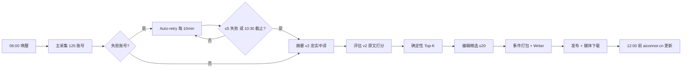

# Connor 项目报告

> 版本：2026-07-23 · 仓库：[github.com/caojiajun777/Connor](https://github.com/caojiajun777/Connor)

---

## 1. 项目概述

**Connor** 是一套面向 AI 前沿资讯的**自动化日报生产系统**。它从 X（Twitter）上的 curated watchlist 采集一手信息，经 LLM 翻译、评分、编辑筛选后，生成结构化中文日报，发布到公开网站 **https://aiconnor.cn**，并可选产出竖屏短视频及多平台分发文案。

### 核心目标

| 目标 | 说明 |
|------|------|
| **信息源可控** | ~125 个官方/员工/分析师/爆料账号，YAML 配置，可审计 |
| **增量采集** | Redis 游标 + 72h 窗口，不静默丢帖 |
| **编辑质量** | 忠实中译 → 原文打分 → 确定性 Top-K → LLM 精选 ≤20 条 |
| **准时发布** | 北京时间 **06:00** 开跑，**12:00** 前完成对外更新 |
| **可运营** | 内部 Console 标注、分析、Run 管理；公开站只读已发布内容 |

---

## 2. 系统架构

```
┌─────────────────────────────────────────────────────────────────────────┐
│                         Windows 本机（生产环境）                          │
├─────────────────────────────────────────────────────────────────────────┤
│  Task Scheduler                                                         │
│    ConnorDailyPublish (06:00/07:00/08:30)  →  采集→写报→发布            │
│    ConnorPublicStack (登录后)               →  API + Next + Tunnel       │
├──────────────┬──────────────────────┬───────────────────────────────────┤
│  Chrome MCP  │  Python Daily Agent  │  前端                               │
│  (Node/TS)   │  (FastAPI + LangGraph)│  Console (Vite) + 公开站 (Next)   │
│  Playwright  │  PostgreSQL + Redis  │  aiconnor.cn via Cloudflare        │
└──────────────┴──────────────────────┴───────────────────────────────────┘
                              │
                              ▼
                    DeepSeek API（LLM）
```

### 技术栈

| 层级 | 技术 |
|------|------|
| X 采集 | Node 20+ · TypeScript · MCP SDK · Playwright · 独立 Chrome Profile |
| 编排 / Agent | Python 3.11+ · LangGraph · SQLAlchemy 2 · Pydantic 2 |
| 存储 | PostgreSQL `connor_daily` · Redis `task-redis`（Docker） |
| LLM | OpenAI 兼容 API（默认 DeepSeek） |
| 内部 Console | React 19 · Vite · TanStack Query · Recharts |
| 公开网站 | Next.js 15 · Tailwind · App Router |
| 短视频 | Remotion 4 · edge-tts · Python 编排 |
| 部署 | Windows 任务计划 · Docker Desktop · Cloudflare Tunnel |

---

## 3. 目录结构

```text
Connor/
├── src/                    # X News MCP 服务（TypeScript → dist/）
├── app/
│   ├── x_watchlist/        # M1：MCP 客户端、清洗、游标、独立采集
│   ├── editorial/          # M2：离线文件级编辑排序（legacy）
│   └── daily/              # M3+：Daily Agent 核心
│       ├── collect_loop/   # 采集循环、账号级 persist
│       ├── report_writing/ # 事件打包 + Writer 写报
│       ├── public/         # 发布、媒体下载、公开 API、分析
│       ├── console/        # 内部 API：标注、Run、Watchlist 审计
│       ├── short_video/    # 短视频策划 / TTS / Remotion 渲染
│       ├── graph/          # LangGraph 薄主图
│       ├── production.py   # 生产编排入口
│       └── daily_publish.py# 端到端：采集→写报→发布
├── config/x_watchlist.yaml # 账号清单（~800 行）
├── frontend/               # Connor Console（内部后台）
├── web/                    # Connor.ai 公开站
├── short_video/            # Remotion 竖屏模板工程
├── scripts/                # DB 初始化、计划任务注册、Smoke 测试
├── tests/                  # pytest 单元 / 集成测试
├── docs/                   # 设计规格与运维文档
└── fixtures/               # 黄金测试样本
```

---

## 4. 端到端数据链路

### 4.1 主链路（每日自动）



### 4.2 各阶段说明

| 阶段 | 模块 | 输入 | 输出 | 关键约束 |
|------|------|------|------|----------|
| **采集** | `collect_loop` · MCP | watchlist YAML · Redis 游标 | `posts` · `account_runs` | fail-fast；裸 repost 不作游标锚点 |
| **Auto-retry** | `retry_failed_collect` | 失败账号列表 | 同 run 增量 persist | 只重试 transient 错误；auth/permanent 跳过 |
| **摘要** | `summarize` v2 | `run_posts` 候选 | `post_summaries` | 忠实中文翻译，无字数上限 |
| **评估** | `evaluate` v2 | 帖子**原文** | `post_evaluations` | 绝对打分，绑定 summary_id |
| **筛选** | `selection_phase` | Top-K 候选卡 | `selection_items` | 入选 ≠ 发布 |
| **写报** | `report_writing` | selection + 事件包 | `DailyReport` draft | 标题/导语/分层正文 + 来源卡片 |
| **发布** | `public/publish` | draft report | `published` + 本地媒体 | `--split-by-day` 只含当日上海时区帖子 |
| **短视频** | `short_video/*` | 已发布 digest | MP4 + 封面 + 平台文案 | 可选 P1 |

### 4.3 采集策略（2026-07 现行）

- **主 pass**：~1s/账号间隔，MCP 不重试 rate limit，empty posts 最多 1 次
- **Auto-retry**：每 **600s** 一轮，worth-retry 失败 **≤5** 则放行
- **发布 deadline**：北京时间 **10:30** 停止 retry（12:00 − 90min 写报预留）
- **失败分类**：`x_service_error` / rate limit / empty posts → 重试；auth / permanent → 跳过

---

## 5. 子系统详解

### 5.1 X News MCP（Milestone 1）

独立 Chrome Profile（`~/.codex-x-news-agent`）只读访问 X：

| 工具 | 用途 |
|------|------|
| `x_session_status` | 会话诊断（结构化 reason_code） |
| `x_search_posts` | Latest 搜索 + 分页 |
| `x_profile_posts` | 账号 Posts 页（含置顶/repost） |
| `x_get_post` | 单帖详情 |

Python 层 `app/x_watchlist/` 负责 MCP 客户端、帖子清洗（`x-clean-posts/v1`）、游标管理、Coverage 报告。独立 M1 采集产物在 `data/x_watchlist_runs/`（gitignore）。

### 5.2 Daily Agent（Milestone 3a–3e）

LangGraph 薄主图 + PostgreSQL 状态机：

| 里程碑 | 能力 |
|--------|------|
| M3a | PG schema · Redis 游标 · advisory lock · 文件游标导入 |
| M3b | 增量采集 · cursor_eligible · 72h 窗口 · account_runs |
| M3c | run_posts 冻结 · 摘要 gate · v2 忠实翻译 |
| M3d | 评估 gate · 确定性 Top-K · Editorial Top≤20 |
| M3e | Checkpointer · start/resume · cron tick · FastAPI · metrics |

规格冻结文档：[`docs/agent-design.md`](agent-design.md)

### 5.3 Connor Console（内部后台）

- 路径：`http://127.0.0.1:5173/console`
- 功能：Run 概览 · 分析仪表盘 · 人工标注（入选/不入选 + 4+4 原因）· Watchlist 审计
- 标注数据存独立 `annotation_*` 表，**不修改**生产 selection

### 5.4 Connor.ai 公开站

- 线上：https://aiconnor.cn
- 路径：`/` · `/daily/[date]` · `/archive` · `/about`
- Next.js 通过 rewrite 代理 `/api/*` · `/media/*` 到 FastAPI :8080
- 页脚承诺：**每日 12:00 更新**；流水线 **06:00** 开跑保障准时

运维文档：[`docs/public-site.md`](public-site.md) · [`docs/cloudflare-tunnel.md`](cloudflare-tunnel.md)

### 5.5 短视频（可选）

```
已发布 digest → Planner → 口播脚本 → edge-tts → Remotion 渲染 → MP4 + 封面
                                                      ↓
                              Bilibili / 抖音 / 小红书 文案
```

产物：`data/short_video_review/<date>/`（gitignore）

---

## 6. 入口与自动化

### 6.1 CLI 速查

```powershell
# ── 采集 ──
python -m app.cli x-watchlist collect [--handles ...]
python -m app.cli x-watchlist audit-accounts [--all|--stale]

# ── 日报生产 ──
python -m app.cli daily init-db
python -m app.cli daily publish-today [--split-by-day] [--accept-gap] [--force]
python -m app.cli daily retry-collect --latest --until-done

# ── 写报 / 发布（手动） ──
python -m app.cli daily write-report --run-id <UUID> --date YYYY-MM-DD
python -m app.cli daily publish-report --report-id <UUID>

# ── 短视频 ──
python -m app.cli daily produce-short-video --report-date YYYY-MM-DD

# ── 服务 ──
python -m app.cli daily serve-api --port 8080
```

### 6.2 Windows 计划任务

| 任务名 | 触发 | 作用 |
|--------|------|------|
| `ConnorDailyPublish` | 06:00 / 07:00 / 08:30 + 登录后 3min | 完整日报流水线 |
| `ConnorPublicStack` | 登录后 | FastAPI + Next + Cloudflare Tunnel |

注册脚本：

```powershell
powershell -File scripts\register_connor_daily_task.ps1
powershell -File scripts\register_connor_public_stack_task.ps1
```

启动器 `scripts/run_daily_and_publish.ps1` 自动：
- 加载 `.env`
- 传 `--split-by-day --accept-gap`
- 强制 `auto_retry=1` · `retry_interval=600s`
- 设置 `publish_deadline=12:00` · `reserve_min=90`

---

## 7. 配置与环境变量

完整模板见 [`.env.example`](../.env.example)。核心分组：

| 分组 | 代表变量 |
|------|----------|
| 数据库 | `CONNOR_DATABASE_URL` · `CONNOR_REDIS_URL` |
| LLM | `CONNOR_LLM_API_KEY` / `DEEPSEEK_API_KEY` |
| 采集 | `CONNOR_COLLECT_AUTO_RETRY` · `CONNOR_COLLECT_RETRY_INTERVAL_SEC` · `X_AGENT_PROFILE_DIR` |
| 调度 | `CONNOR_SCHEDULE_HOUR/TZ` · `CONNOR_PUBLISH_DEADLINE_*` |
| 公开站 | `CONNOR_PUBLIC_SITE_URL` · `CONNOR_OPS_API_KEY` · `CONNOR_PUBLIC_API_BASE` |
| 媒体 | `CONNOR_MEDIA_STORAGE` · `CONNOR_MEDIA_LOCAL_ROOT` |

---

## 8. 测试

```powershell
# Python 全量
python -m pytest

# MCP TypeScript
pnpm run build && pnpm test

# 公开站
cd web && npm test

# 流水线 smoke
python scripts/smoke_daily_pipeline.py
```

重点测试目录：
- `tests/daily/` — M3 里程碑 · E2E · retry/deadline · 短视频
- `tests/x_watchlist/` — MCP · 清洗 · 游标
- `tests/console/` — 标注 API

---

## 9. 设计原则与不变量

1. **游标只定义增量边界**，不因 convenience 静默丢帖
2. **裸 repost 采集但不作游标锚点**
3. **selection_items ≠ published**；忠实翻译 ≠ 日报正文
4. **评估读原文**，摘要用中译，写报用事件包 + Writer 分层正文
5. **Fail-forward 采集**：主 pass 快速失败 → 冷却 retry → deadline 放行写报
6. **人工标注与生产隔离**，仅用于质量反馈与模型迭代

---

## 10. 当前状态（2026-07-23）

| 模块 | 状态 |
|------|------|
| X MCP 采集 | ✅ 生产运行，125 账号 watchlist |
| Daily Agent M3a–3e | ✅ 完整链路打通 |
| 自动发布 | ✅ 计划任务 06:00，deadline 感知 retry |
| 公开站 aiconnor.cn | ✅ Cloudflare Tunnel 上线 |
| Console 标注 v2 | ✅ 简化为入选/不入选 + 固定原因 |
| 短视频 | ✅ Remotion 渲染链路可用（P1） |
| 分析仪表盘 | ✅ 公开站 beacon + Console 统计 |

---

## 11. 相关文档索引

| 文档 | 内容 |
|------|------|
| [`README.md`](../README.md) | 快速上手与 CLI 参考 |
| [`docs/agent-design.md`](agent-design.md) | Daily Agent 规格 v1 |
| [`docs/x-source-collection-design.md`](x-source-collection-design.md) | 采集层设计 |
| [`docs/public-site.md`](public-site.md) | 公开站运维 |
| [`docs/cloudflare-tunnel.md`](cloudflare-tunnel.md) | Tunnel 配置 |
| [`docs/console-development-plan.md`](console-development-plan.md) | Console 规划 |
| [`web/README.md`](../web/README.md) | 公开站前端 |

---

*本报告由项目代码与运维配置梳理生成，随代码演进需同步更新。*
